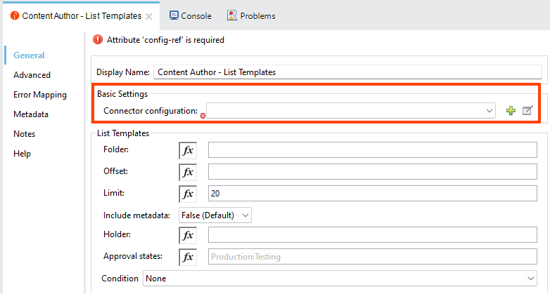

[[AnypointConnector_01]]
== Introduction

The Anypoint Connector integrates the
https://www.quadient.com/documentation?productId=inspire-evolve-general&documentType=overview&language=en[functionality
of Inspire Evolve] into your business applications. You can use it to
manage and customize your communications with Inspire Evolve.

This document is intended for Inspire Evolve users and describes the
Anypoint Connector and its configuration for integrating Inspire Evolve
applications:

* link:#AnypointConnector_12[Content Author] – Allows line of business
users to create, author, and maintain communication templates, external
blocks, display rules, and other resources. It also provides
customizable approval processes to ensure that content is validated
before use.
* link:#AnypointConnector_14[Front Office] – Enables line of business
users to personalize communications while maintaining standard text and
styling, with variable fields pre-filled from the core system. It also
offers customizable approval processes to validate communications before
sending them through various digital and physical channels.
* link:#AnypointConnector_05[Generate] – Provides a highly-scalable and
secure cloud-based service for the development, testing and production.

[TIP]
====
For further options for integrating with Inspire Evolve, see the
https://www.quadient.com/documentation?productId=inspire-evolve-general&component=integration&documentType=configuration-guide&version=[Inspire
Evolve Integration – Configuration Guide] document.
====

[[AnypointConnector_02]]
== Requirements

Here are the software requirements for using the connector:

[width="100%",cols="50%,50%",]
|===
|Mule Runtime |4.6 or newer
|Java |1.8, 11, 17
|Inspire Evolve |N/A
|===

[IMPORTANT]
====
* This document requires you to be familiar with Mule, Anypoint
Connectors, Anypoint Studio, Mule concepts, elements in a Mule flow, and
Global Elements.
* You need the API Key to test your connection to your target resource.
See the Configuring Open API Key section for details.
====

[[AnypointConnector_03]]
== Configuring Open API Key

To configure the Open API key:

[arabic]
. Add any operation and create a new Connector configuration.
+

. The Global Element Properties dialog opens.
+
image:Images/Anypoint01.png[The Global Element Properties dialog.]
. Specify the URL of your company in Quadient Cloud via Quadient company
address.
. Specify the API key created in the company in Quadient Cloud (in
ADMINISTRATION | API Keys).
+
To see the value of the key, enable Show password.
. Choose one of the applications you are using in Inspire Evolve (for
which you have configured the API).
+
The application selected here is used only for the purposes of
validation. If you have API configured for multiple applications, you
can select any of them.
. Click on the Test Connection button to validate the connection to
Inspire Evolve via the specified API Key.
+
If successful, a confirmation message is displayed:
+

. Once the connection is validated, you can proceed to configuring the
link:#AnypointConnector_04[operations].

[[AnypointConnector_04]]
== Operations

Here you can find the configuration of operations for integration the
individual Inspire Evolve applications:

* link:#AnypointConnector_12[Content Author] – for integrating Content
Author.
* link:#AnypointConnector_14[Front Office] – for integrating Front
Office (single document) mode.
* link:#AnypointConnector_08[Generate in Batch Mode] – for integrating
Generate in batch (multiple documents) mode.
* link:#AnypointConnector_05[Generate in On-Demand Mode] – for
integrating Generate in on-demand (single document) mode.

[[AnypointConnector_12]]
=== Content Author

This section describes the configuration of operations for use with the
Content Author application.

See the
https://www.quadient.com/documentation?productId=inspire-evolve-general&documentType=overview&version=&language=en&contextHelpId=Content_Author[Content
Author] section in the Inspire Evolve - An Overview document at Quadient
University for additional information about Content Author.

[[AnypointConnector_13]]
==== Content Author – List Templates

image:Images/Anypoint08.png[Configuring the Content Author – Get
Templates operation.]

Retrieves templates from Content Author.

*Required Parameters*

There are no required parameters.

*Response*

Returns a JSON containing the templates with the following information:

* Name – Name of the template.
* Version – The version of the template.
* Edited – The date and time of the last edit.
* Metadata – The template's metadata, i.e. properties that provide basic
information about the document.

*Multipart Data*

To send multipart data, use the Attachments option:

Name::
  Specifies the name of the attachment.
  +
  This name will be used to reference the data part in Generate
  `+request://+`, e.g. if Name is set to _Part1_, the request will be
  `+request://Part1+`.
Data::
  Specifies the content that will be passed as multipart data.

[[AnypointConnector_14]]
=== Front Office

This section describes the configuration of operations for use with the
Front Office application.

See the
https://www.quadient.com/documentation?productId=inspire-evolve-general&documentType=overview&version=&language=en&contextHelpId=Front_Office[Front
Office] section in the Inspire Evolve - An Overview document at Quadient
University for additional information about Front Office.

[[AnypointConnector_15]]
==== Front Office – Create Ticket

image:Images/Anypoint09.png[Configuring the Front Office – Create Ticket
operation.]

Creates a new ticket in Front Office.

See the
https://www.quadient.com/documentation?productId=front-office&documentType=user-manual&version=24.10&language=en&id=ticket[Tickets]
section in the -Front Office – User Manual for detailed information
about tickets in Front Office.

*Required Parameters*

Template path::
  Specifies the path to an existing template from which the ticket will
  be created, e.g.
  _icm:S:Production:S:UserResource//Interactive/StandardPackage/Templates/StandardDemo/Celeste/Car
  Loan Offer.jld_.

State ID::
  Specifies the state ID of the ticket, e.g.
  _S_template_scenario_assigned_.
  +
  The state must be in the approval process.
  +
  See the
  https://www.quadient.com/documentation?productId=front-office&documentType=user-manual&version=24.10&language=en&id=ApprovalProcesses_33[Front
  Office – User Manual] for additional information about this option.
Holder::
  Specifies the email address or the user role of the ticket's holder,
  e.g. _lee@vital.com_ or _Senior Writer_.
Holder type::
  Selects to which users the object will be assigned in this state
  (specific users or a group of users).

*Response*

Returns a JSON with the GUID.

[[AnypointConnector_08]]
=== Generate in Batch Mode

This section describes the configuration of operations for use with the
batch mode of the Generate application.

See the
https://www.quadient.com/documentation?productId=inspire-evolve-general&documentType=overview&version=&language=en&contextHelpId=Generate[Generate]
section in the Inspire Evolve - An Overview document at Quadient
University for additional information about Generate.

[[AnypointConnector_09]]
==== Batch –– Start Batch Job

image:Images/Anypoint05.png[Configuring the Batch – Start Batch Job
operation.]

Creates a new batch job in Generate.

*Required Parameters*

Pipeline Name::
  Specifies a unique name of the processing pipeline.
  +
  If the pipeline is inside a folder, this parameter must contain the
  whole path, e.g. `+PipelineName:'Folder/NestedFolder/pipelineName'+`.

*Response*

workingFolderId::
  ID of the current working folder for the initiated batch job.
batchJobId::
  Batch job ID of the initiated batch job.

*Multipart Data*

To send multipart data, use the Attachments option:

Name::
  Specifies the name of the attachment.
  +
  This name will be used to reference the data part in Generate
  `+request://+`, e.g. if Name is set to _Part1_, the request will be
  `+request://Part1+`.
Data::
  Specifies the content that will be passed as multipart data.

[[AnypointConnector_10]]
==== Batch – Batch Job Status

image:Images/Anypoint06.png[Configuring the Batch – Batch Job Status
operation.]

Retrieves the status of a batch job in Generate.

*Required Parameters*

Batch Job ID::
  Specifies an unique identifier of the batch job.

*Response*

Returns the current status of the specified batch job:

* 'WaitingForProcessing',
* 'Preprocessing',
* 'Processing',
* 'Finished',
* 'Failed',
* 'Unknown',
* 'Stopping',
* 'Stopped',
* 'TimedOut',
* 'Skipped',
* 'PartiallyFinished',
* 'Running'

[[AnypointConnector_11]]
==== Batch – Create Working Folder

image:Images/Anypoint07.png[Configuring the Batch – Create Working
Folder operation.]

Creates a new working folder in Generate.

*Required Parameters*

Name::
  Specifies the name of the working folder.
  +
  It will be visible in GUI and included in the folder's ID.

*Response*

Returns the ID of the working folder in plain text format.

[[AnypointConnector_05]]
=== Generate in On-Demand Mode

This section describes the configuration of operations for use with the
on-demand mode of the Generate application.

See the
https://www.quadient.com/documentation?productId=inspire-evolve-general&documentType=overview&version=&language=en&contextHelpId=Generate[Generate]
section in the Inspire Evolve - An Overview document at Quadient
University for additional information about Generate.

[[AnypointConnector_06]]
==== *OnDemand – OnDemand*

image:Images/Anypoint04.png[Configuring the OnDemand – OnDemand
operation.]

Starts and receives results of on-demand jobs in Generate. This includes
PDF generation and downloading.

*Required Parameters*

Pipeline Name::
  Specifies a unique name of the processing pipeline.
  +
  If the pipeline is inside a folder, this parameter must contain the
  whole path, e.g. `+PipelineName:'Folder/NestedFolder/pipelineName'+`.

*Response*

The content of the response depends on the job.

*Multipart Data*

To send multipart data, use the Attachments option:

Name::
  Specifies the name of the attachment.
  +
  This name will be used to reference the data part in Generate
  `+request://+`, e.g. if Name is set to _Part1_, the request will be
  `+request://Part1+`.
Data::
  Specifies the content that will be passed as multipart data.

[[AnypointConnector_07]]
==== *OnDemand – OnDemand Custom Data*

image:Images/Anypoint03.png[Configuring the OnDemand – OnDemand Custom
Data operation.]

Starts and receives results of on-demand jobs while passing custom data.

*Required Parameters*

Pipeline Name::
  Specifies a unique name of the processing pipeline.
  +
  If the pipeline is inside a folder, this parameter must contain the
  whole path, e.g. `+PipelineName:'Folder/NestedFolder/pipelineName'+`.

*Response*

The content of the response depends on the job.

[[AnypointConnector_17]]
== Useful Links

Here you can find links to documents and manuals that can help you with
the configuration process.

* `+https://yourCompany.inspirecloud.eu/doc/?product=generate&document=user-guide&id=introduction+`
* `+https://yourCompany.inspirecloud.eu/doc/?product=content-author&document=user-manual&id=dashboardCommon+`
* `+https://yourCompany.inspirecloud.eu/doc/?product=front-office&document=user-manual&id=dashboardCommon+`

* `+https://yourCompany.inspirecloud.eu/doc/OpenApi/OnDemand.json+`
* `+https://yourCompany.inspirecloud.eu/doc/OpenApi/Batch.json+`
* `+https://yourCompany.inspirecloud.eu/authoring/api/system/v1+`
* `+https://yourCompany.inspirecloud.eu/frontoffice/api/system/v2+`

*Quadient Support*

https://www.quadient.com/en/contact-us[]
